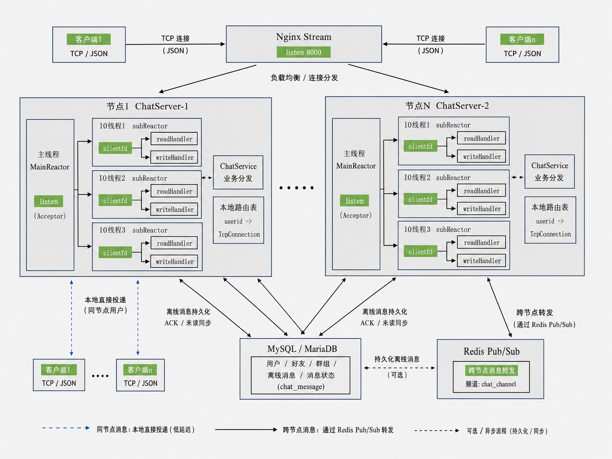

# muduo-distributed-chat-server

基于 muduo + MySQL + Redis 的分布式聊天服务器，支持注册登录、好友管理、单聊、群聊、离线消息、跨节点消息转发和 Nginx TCP 负载均衡。

- 基于 muduo 多 Reactor 模型实现 TCP 长连接通信
- 基于 JSON 设计应用层消息协议，支持注册、登录、单聊、群聊等业务消息
- 基于 MySQL / MariaDB 持久化用户、好友、群组和离线消息
- 基于 Redis Pub/Sub 实现多 ChatServer 节点之间的消息转发
- 支持 Nginx Stream 对多个 ChatServer 节点进行 TCP 四层负载均衡
- 引入 message_id、ACK 和消息状态字段，用于消息投递跟踪和未读消息同步
- 支持心跳保活，降低长连接空闲断开的概率

---

## 架构图




用户登录到某个 ChatServer 后，该节点维护 `userid -> TcpConnection` 的本地连接映射，并订阅 Redis 中以 `userid` 命名的 channel。

当用户 A 向用户 B 发送消息时：

- 如果 B 在线且连接在本节点，直接通过本地 TcpConnection 投递。
- 如果 B 在线但连接在其他节点，通过 Redis Pub/Sub 转发到对应 ChatServer。
- 如果 B 离线，消息持久化到数据库，等待 B 下次登录后同步。

---

## 目录介绍

```text
.
├── benchmark/              # 基础测试脚本
├── bin/                    # 编译生成的可执行文件
├── config/                 # 服务端环境变量和 Nginx 配置示例
├── docs/                   # 架构、协议和测试说明
├── include/                # 头文件
├── scripts/                # 编译和启动脚本
├── sql/                    # 数据库初始化脚本
├── src/
│   ├── client/             # 客户端代码
│   └── server/
│       ├── db/             # MySQL 连接封装
│       ├── model/          # 用户、好友、群组、消息模型
│       ├── redis/          # Redis 发布订阅封装
│       ├── chatserver.cpp  # muduo TcpServer 封装
│       └── chatservice.cpp # 业务分发与核心逻辑
├── thirdparty/             # 第三方头文件
└── CMakeLists.txt
```

---

## 环境依赖

开发和测试环境：

```text
Alibaba Cloud Linux 3 / CentOS-like
C++11
CMake
muduo
MySQL / MariaDB
Redis
hiredis
Nginx
nlohmann/json
```

安装基础依赖：

```bash
yum install -y gcc gcc-c++ cmake make mysql-devel hiredis-devel nginx redis mariadb-server
```

muduo 需要单独安装，并确保系统可以链接：

```text
muduo_net
muduo_base
```

---

## 快速启动

### 1. 启动 MySQL 和 Redis

```bash
systemctl enable --now mariadb
systemctl enable --now redis
redis-cli ping
```

Redis 正常时应返回：

```text
PONG
```

### 2. 初始化数据库

```bash
mysql -uroot -p < sql/init.sql
```

如果本地 root 用户无密码：

```bash
mysql -uroot < sql/init.sql
```

### 3. 配置服务端环境变量

```bash
cp config/server.env.example config/server.env
vim config/server.env
source config/server.env
```

示例配置：

```bash
CHAT_DB_HOST=127.0.0.1
CHAT_DB_PORT=3306
CHAT_DB_USER=root
CHAT_DB_PASSWORD=123456
CHAT_DB_NAME=chat

CHAT_REDIS_HOST=127.0.0.1
CHAT_REDIS_PORT=6379
CHAT_REDIS_PASSWORD=
CHAT_REDIS_DB=0
```


### 4. 编译

```bash
./scripts/build.sh
```

编译完成后会生成：

```text
bin/ChatServer
bin/ChatClient
```

### 5. 启动单节点 ChatServer

```bash
source config/server.env
./bin/ChatServer 127.0.0.1 6000
```

新开终端启动客户端：

```bash
./bin/ChatClient 127.0.0.1 6000
```

客户端支持注册、登录、添加好友、单聊、创建群组、加入群组和群聊。

---

## 多节点部署

启动两个 ChatServer 节点：

```bash
source config/server.env
./bin/ChatServer 127.0.0.1 6000
```

```bash
source config/server.env
./bin/ChatServer 127.0.0.1 6002
```

将 `config/nginx_tcp.conf` 合并到 Nginx 配置后，检查并重载：

```bash
nginx -t
nginx -s reload
```

客户端连接 Nginx 入口：

```bash
./bin/ChatClient 127.0.0.1 8000
```

Nginx 负责将不同客户端连接分发到多个 ChatServer 节点，Redis Pub/Sub 负责不同节点之间的消息转发。

---

## 消息状态

`chat_message` 表用于记录消息投递状态：

```text
0 created    服务端已持久化，尚未投递到接收方连接
1 delivered  服务端已投递到接收方连接，等待客户端 ACK
2 acked      客户端已确认收到
```

基本流程：

```text
1. 服务端收到聊天请求后生成 message_id
2. 消息写入 chat_message 表，状态为 created
3. 接收方在线时立即投递，并更新为 delivered
4. 客户端收到消息后发送 ACK
5. 服务端收到 ACK 后将状态更新为 acked
6. 接收方离线时，消息保留在数据库中
7. 接收方重新登录后，服务端同步未确认消息
```

---

## 基础测试

项目提供 `benchmark/bench_client.py`，用于模拟多客户端连接、登录和单聊消息收发，主要用于功能验证和稳定性观察。

注册测试用户：

```bash
python3 benchmark/bench_client.py \
  --host 127.0.0.1 \
  --port 6000 \
  --mode register \
  --users 100 \
  --password 123456 \
  --concurrency 50
```

单聊链路测试：

```bash
python3 benchmark/bench_client.py \
  --host 127.0.0.1 \
  --port 6000 \
  --mode chat \
  --start-id 1 \
  --users 100 \
  --password 123456 \
  --messages-per-user 20 \
  --concurrency 50
```

该脚本用于辅助验证连接、登录、消息收发和 ACK 流程，不作为极限性能测试结果。

---

## 文档

- [架构说明](docs/architecture.md)
- [应用层协议](docs/protocol.md)
- [基础测试说明](docs/perf-test.md)

---

## 后续优化方向

- 将当前 `JSON + '\n'` 协议升级为 `固定长度消息头 + JSON Body`
- 优化客户端输入校验，避免非法输入导致客户端异常
- 优化可靠消息投递链路，支持 ACK 批量更新和异常重试
- 增加 CI 构建检查，保证代码提交后能够自动编译验证
